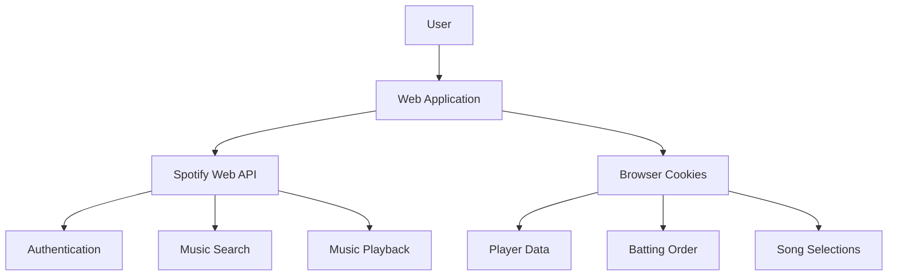

# Design Document: Spotify Walk-up Music Web App

## Overview

The Spotify Walk-up Music Web App is a client-side web application that allows baseball team managers or players to create and manage walk-up music playlists using Spotify. Users can authenticate with Spotify, create a list of players, select and segment songs for each player, arrange them in a batting order, and play them sequentially during a game. All data will be stored locally in cookies without requiring remote storage.

## Architecture

The application will follow a client-side architecture with the following components:

1. **Frontend Application**: A single-page application (SPA) built with HTML, CSS, and JavaScript.
2. **Spotify Web API Integration**: For authentication and accessing Spotify's music library.
3. **Local Storage**: Using browser cookies for data persistence.



## Components and Interfaces

### 1. Authentication Component

Responsible for handling Spotify authentication flow.

**Interfaces:**
- `initializeAuth()`: Sets up the authentication process
- `authenticateWithSpotify()`: Redirects to Spotify authorization
- `handleAuthCallback()`: Processes the callback from Spotify
- `refreshToken()`: Refreshes the authentication token when expired
- `isAuthenticated()`: Checks if the user is authenticated
- `logout()`: Clears authentication data

### 2. Player Management Component

Handles the creation, editing, and deletion of players.

**Interfaces:**
- `addPlayer(name)`: Adds a new player to the roster
- `getPlayers()`: Returns the list of all players
- `updatePlayer(id, data)`: Updates a player's information
- `deletePlayer(id)`: Removes a player from the roster
- `getPlayerById(id)`: Retrieves a specific player's data

**Data Model:**
```javascript
{
  id: "unique-id",
  name: "Player Name",
  songSelection: {
    trackId: "spotify-track-id",
    trackName: "Song Name",
    artistName: "Artist Name",
    startTime: 30, // in seconds
    endTime: 60, // in seconds
    duration: 30 // in seconds
  }
}
```

### 3. Spotify Integration Component

Handles interaction with the Spotify Web API.

**Interfaces:**
- `searchSongs(query)`: Searches for songs matching the query
- `getTrack(trackId)`: Gets detailed information about a specific track
- `playSong(trackId, startTime)`: Plays a song from the specified time
- `pauseSong()`: Pauses the currently playing song
- `getCurrentPlaybackState()`: Gets information about the current playback
- `seekToPosition(positionMs)`: Seeks to a specific position in the track

### 4. Song Segmentation Component

Allows users to select specific segments of songs.

**Interfaces:**
- `initializePlayer(trackId)`: Sets up the audio player for a track
- `setStartTime(timeInSeconds)`: Sets the start time for the segment
- `setEndTime(timeInSeconds)`: Sets the end time for the segment
- `previewSegment()`: Plays the selected segment for preview
- `saveSegment(playerId, segmentData)`: Saves the segment to a player's profile

### 5. Batting Order Component

Manages the arrangement of players in a batting order.

**Interfaces:**
- `getBattingOrder()`: Returns the current batting order
- `updateBattingOrder(newOrder)`: Updates the batting order
- `movePlayer(playerId, newPosition)`: Moves a player to a new position in the order
- `getNextBatter(currentPosition)`: Gets the next player in the batting order

### 6. Game Mode Component

Controls the playback of walk-up music during a game.

**Interfaces:**
- `startGameMode()`: Initializes the game mode interface
- `playNextBatter()`: Plays the walk-up music for the next batter
- `getCurrentBatter()`: Returns the current batter
- `getOnDeckBatters(count)`: Returns the specified number of upcoming batters
- `skipCurrentSong()`: Skips the currently playing song
- `resetBattingOrder()`: Resets to the beginning of the batting order

### 7. Storage Component

Handles saving and retrieving data from cookies.

**Interfaces:**
- `saveData(key, data)`: Saves data to cookies
- `getData(key)`: Retrieves data from cookies
- `clearData(key)`: Removes specific data from cookies
- `clearAllData()`: Clears all application data from cookies

## Data Models

### Player Model
```javascript
{
  id: String, // Unique identifier
  name: String, // Player name
  position: Number // Position in batting order
}
```

### Song Selection Model
```javascript
{
  playerId: String, // Reference to player
  trackId: String, // Spotify track ID
  trackName: String, // Song name
  artistName: String, // Artist name
  albumArt: String, // URL to album artwork
  startTime: Number, // Start time in seconds
  endTime: Number, // End time in seconds
  duration: Number // Segment duration in seconds
}
```

### Batting Order Model
```javascript
{
  order: [String] // Array of player IDs in batting order
}
```

### Application State Model
```javascript
{
  currentBatterIndex: Number, // Index of current batter in order
  isPlaying: Boolean, // Whether music is currently playing
  gameMode: Boolean // Whether game mode is active
}
```

## Error Handling

### Authentication Errors
- Handle failed authentication attempts with clear error messages
- Implement automatic retry for token refresh failures
- Provide guidance for common authentication issues

### Spotify API Errors
- Implement retry logic for transient API failures
- Cache responses where appropriate to reduce API calls
- Handle rate limiting with exponential backoff

### Data Storage Errors
- Handle cookie size limitations by splitting data if necessary
- Provide fallback options when cookies are disabled
- Implement data validation before saving

### Playback Errors
- Handle network interruptions during playback
- Provide fallback options when a track is unavailable
- Implement error recovery for playback failures

## Testing Strategy

### Unit Testing
- Test individual components in isolation
- Mock Spotify API responses for consistent testing
- Verify component interfaces behave as expected

### Integration Testing
- Test interactions between components
- Verify data flow between components
- Test authentication flow with mock Spotify responses

### End-to-End Testing
- Test complete user workflows
- Verify application behavior in different browsers
- Test responsive design on different screen sizes

### User Acceptance Testing
- Verify the application meets all requirements
- Test with real Spotify accounts (in development mode)
- Gather feedback on usability and user experience

## Security Considerations

### Authentication Security
- Store authentication tokens securely
- Implement proper token refresh flow
- Clear sensitive data on logout

### Data Privacy
- Store only necessary data in cookies
- Do not store sensitive Spotify account information
- Provide clear information about data usage

### Cross-Site Scripting Prevention
- Sanitize all user inputs
- Implement Content Security Policy
- Use proper encoding for dynamic content

## Deployment Strategy

The application will be hosted on GitHub Pages, which provides free hosting for static websites directly from a GitHub repository.

### Deployment Process
1. Create a GitHub repository for the project
2. Set up GitHub Pages for the repository
3. Configure the domain settings if a custom domain is desired
4. Set up automated deployment using GitHub Actions

### Spotify Developer Application
1. Register a Spotify Developer Application
2. Configure the redirect URI to match the GitHub Pages URL
3. Obtain client ID for use in the application
4. Set appropriate scopes for the required permissions

## User Interface Design

### Main Layout
The application will have a responsive layout with the following main views:

1. **Authentication View**: Initial view for Spotify login
2. **Player Management View**: Interface for adding and managing players
3. **Song Selection View**: Interface for searching and selecting song segments
4. **Batting Order View**: Interface for arranging players in batting order
5. **Game Mode View**: Interface for controlling playback during a game

### Mobile Considerations
- Simplified layout for smaller screens
- Touch-friendly controls
- Collapsible sections to maximize screen space
- Bottom navigation for easy access to key features

### Desktop Enhancements
- Multi-column layout for efficient use of space
- Keyboard shortcuts for common actions
- Drag-and-drop functionality for batting order
- Advanced visualization of audio waveforms for precise segment selection