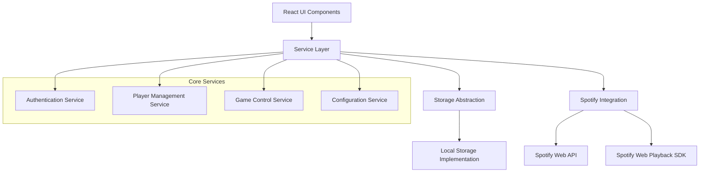

# Design Document

## Overview

The Walk-Up Music Manager is a single-page React application that integrates with Spotify's Web API and Web Playback SDK to manage baseball walk-up music. The application uses a clean architecture with dependency injection, separating concerns between authentication, data management, music playback, and user interface components.

The system is designed around three core domains:

- **Authentication**: Handles Spotify PKCE OAuth flow and token management
- **Player Management**: Manages player profiles and song selections
- **Game Control**: Handles batting orders and game-time music playback

## Architecture

### High-Level Architecture



### Component Architecture

The application follows a layered architecture:

1. **Presentation Layer**: React components for UI
2. **Service Layer**: Business logic and API integration
3. **Storage Layer**: Abstracted data persistence
4. **Integration Layer**: Spotify API and SDK wrappers

### Technology Stack

- **Frontend Framework**: React with TypeScript
- **State Management**: React Context + useReducer for complex state
- **Styling**: CSS Modules or Styled Components
- **Build Tool**: Vite for fast development and GitHub Pages deployment
- **Authentication**: Spotify PKCE OAuth 2.0 flow
- **Music Integration**: Spotify Web API + Web Playback SDK
- **Storage**: Local Storage with abstracted interface

## Components and Interfaces

### Core Interfaces

```typescript
// Storage abstraction for future backend integration
interface StorageService {
  save<T>(key: string, data: T): Promise<void>;
  load<T>(key: string): Promise<T | null>;
  delete(key: string): Promise<void>;
  clear(): Promise<void>;
  export(): Promise<string>; // JSON export
  import(data: string): Promise<void>; // JSON import
}

// Authentication service interface
interface AuthService {
  login(): Promise<void>;
  logout(): Promise<void>;
  getAccessToken(): Promise<string | null>;
  isAuthenticated(): boolean;
  refreshToken(): Promise<void>;
}

// Player management interface
interface PlayerService {
  createPlayer(name: string): Promise<Player>;
  updatePlayer(id: string, updates: Partial<Player>): Promise<Player>;
  deletePlayer(id: string): Promise<void>;
  getPlayer(id: string): Promise<Player | null>;
  getAllPlayers(): Promise<Player[]>;
  searchSongs(query: string): Promise<SpotifyTrack[]>;
}

// Game control interface
interface GameService {
  createBattingOrder(playerIds: string[]): Promise<BattingOrder>;
  updateBattingOrder(order: BattingOrder): Promise<BattingOrder>;
  getCurrentBatter(): Player | null;
  getOnDeckBatter(): Player | null;
  getInTheHoleBatter(): Player | null;
  nextBatter(): Promise<void>;
  playWalkUpMusic(player: Player): Promise<void>;
  stopMusic(): Promise<void>;
}
```

### Data Models

```typescript
interface Player {
  id: string;
  name: string;
  song?: {
    spotifyId: string;
    title: string;
    artist: string;
    albumArt: string;
    previewUrl: string;
    startTime: number; // seconds
    duration: number; // seconds (max configurable, default 10)
  };
  createdAt: Date;
  updatedAt: Date;
}

interface BattingOrder {
  id: string;
  name: string;
  playerIds: string[];
  currentPosition: number;
  createdAt: Date;
  updatedAt: Date;
}

interface SpotifyTrack {
  id: string;
  name: string;
  artists: string[];
  album: string;
  albumArt: string;
  previewUrl: string;
  durationMs: number;
  uri: string;
}

interface AppConfig {
  maxSegmentDuration: number; // seconds, default 10
  spotifyClientId: string;
  redirectUri: string;
}
```

### Service Implementations

#### Authentication Service

- Implements PKCE OAuth flow with code verifier/challenge generation
- Manages access/refresh tokens in secure HTTP-only cookies
- Handles token refresh automatically
- Validates Spotify Premium subscription

#### Player Service

- CRUD operations for player management
- Integrates with Spotify Search API
- Handles song segment selection and validation
- Manages player data persistence

#### Game Service

- Manages batting order creation and modification
- Tracks current game state (current batter position)
- Integrates with Spotify Web Playback SDK
- Handles music playback with precise timing control

#### Storage Service

- Abstracts storage operations behind interface
- Local Storage implementation for initial version
- Export/import functionality for data portability
- Designed for easy backend integration later

### React Component Structure

```
App
├── AuthProvider (Context)
├── ConfigProvider (Context)
├── Router
    ├── LoginPage
    ├── DashboardPage
    │   ├── ModeToggle
    │   ├── EditMode
    │   │   ├── PlayerManager
    │   │   │   ├── PlayerList
    │   │   │   ├── PlayerForm
    │   │   │   └── SongSelector
    │   │   └── BattingOrderManager
    │   │       ├── OrderBuilder
    │   │       └── OrderList
    │   └── GameMode
    │       ├── CurrentBatterDisplay
    │       ├── UpcomingBatters
    │       └── GameControls
    └── SettingsPage
        ├── ConfigForm
        └── DataManager (Export/Import)
```

## Data Models

### Player Data Structure

Players are stored with their basic information and optional song selection. The song data includes Spotify metadata and user-defined segment timing.

### Batting Order Structure

Batting orders maintain references to player IDs rather than embedding player data, allowing for efficient updates when player information changes.

### Configuration Structure

Application configuration is stored separately and includes customizable settings like maximum segment duration and Spotify app credentials.

## Error Handling

### Authentication Errors

- Invalid credentials: Redirect to login with error message
- Token expiration: Automatic refresh attempt, fallback to re-login
- Premium subscription required: Clear error message with upgrade link
- Network errors: Retry mechanism with exponential backoff

### Playback Errors

- Device not available: Prompt user to select active Spotify device
- Track not playable: Skip to next batter with notification
- Network interruption: Graceful degradation with retry
- SDK initialization failure: Fallback to preview URLs where available

### Data Errors

- Storage quota exceeded: Prompt for data cleanup or export
- Corrupted data: Attempt recovery, fallback to fresh start
- Import validation errors: Detailed error messages with correction guidance
- Sync conflicts: User-guided conflict resolution

### Network Errors

- API rate limiting: Implement exponential backoff
- Offline mode: Cache critical data, queue operations
- CORS issues: Clear documentation for GitHub Pages deployment
- Timeout handling: Configurable timeouts with user feedback

## Testing Strategy

### Unit Testing

- Service layer methods with mocked dependencies
- React component rendering and user interactions
- Data model validation and transformation
- Utility functions (PKCE generation, time calculations)

### Integration Testing

- Spotify API integration with test credentials
- Storage service implementations
- Authentication flow end-to-end
- Music playback functionality

### End-to-End Testing

- Complete user workflows (login → create player → set order → play music)
- Cross-browser compatibility testing
- Mobile responsiveness testing
- GitHub Pages deployment validation

### Testing Tools

- **Unit Tests**: Jest + React Testing Library
- **Integration Tests**: Jest with MSW for API mocking
- **E2E Tests**: Playwright for cross-browser testing
- **Visual Testing**: Storybook for component documentation

### Test Data Strategy

- Mock Spotify API responses for consistent testing
- Test player data factories for various scenarios
- Automated test data cleanup
- Separate test environment configuration

### Performance Testing

- Bundle size analysis and optimization
- Spotify API response time monitoring
- Local storage performance with large datasets
- Music playback latency testing

The testing strategy ensures reliability across all user workflows while maintaining fast feedback loops during development.
